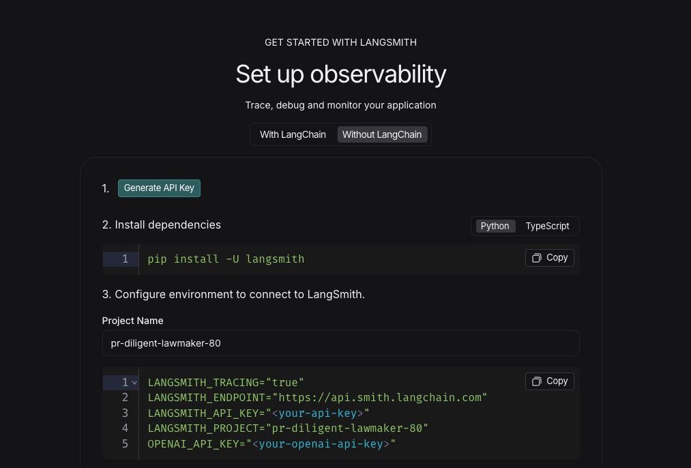
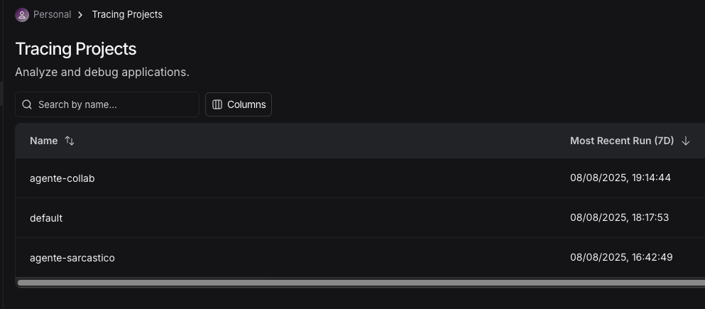

# langgraph_collab

O FireCrawl serve para fazer com que as LLMs façam Webscrapping nas paginas
fire_colab, serve para criar relatorios completos utilizando o firecrawl para obter informações mais detalhadas

# gerar tracing project

